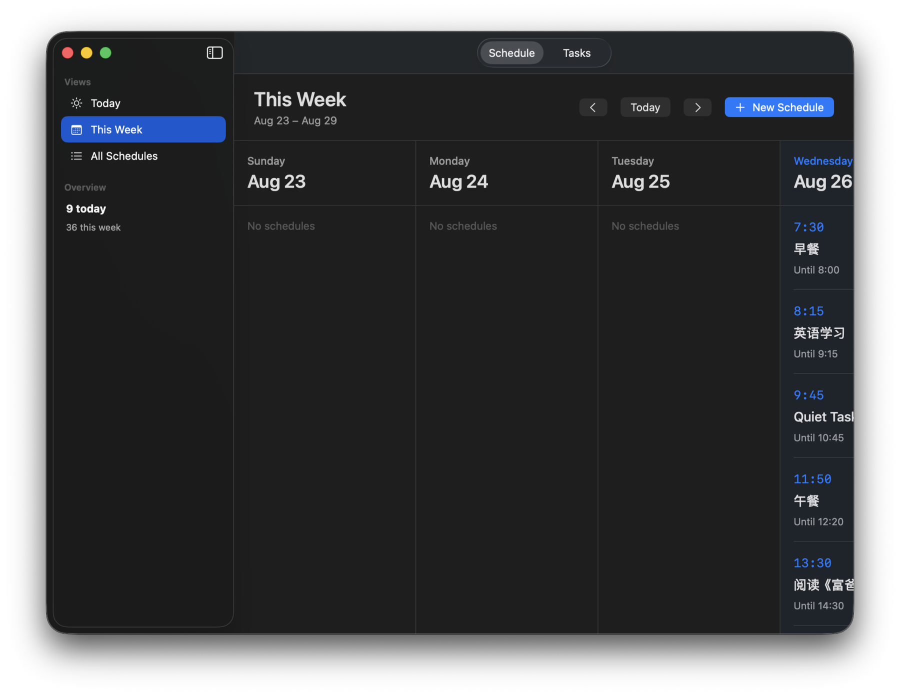
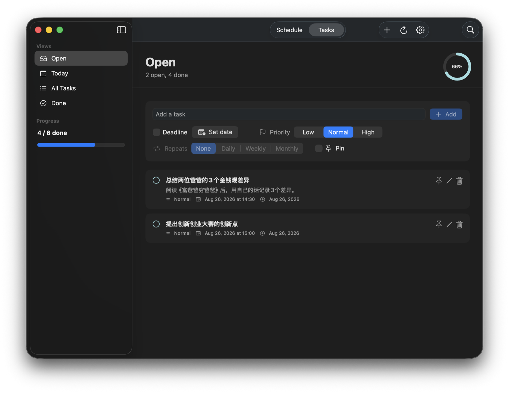
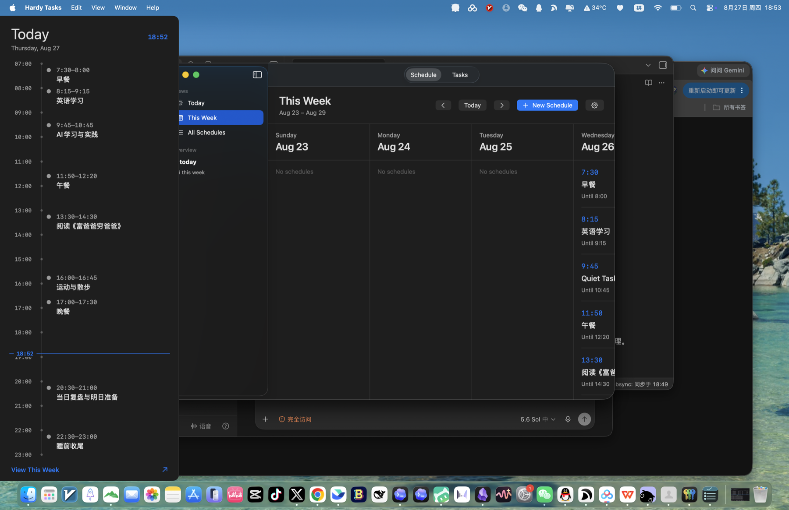
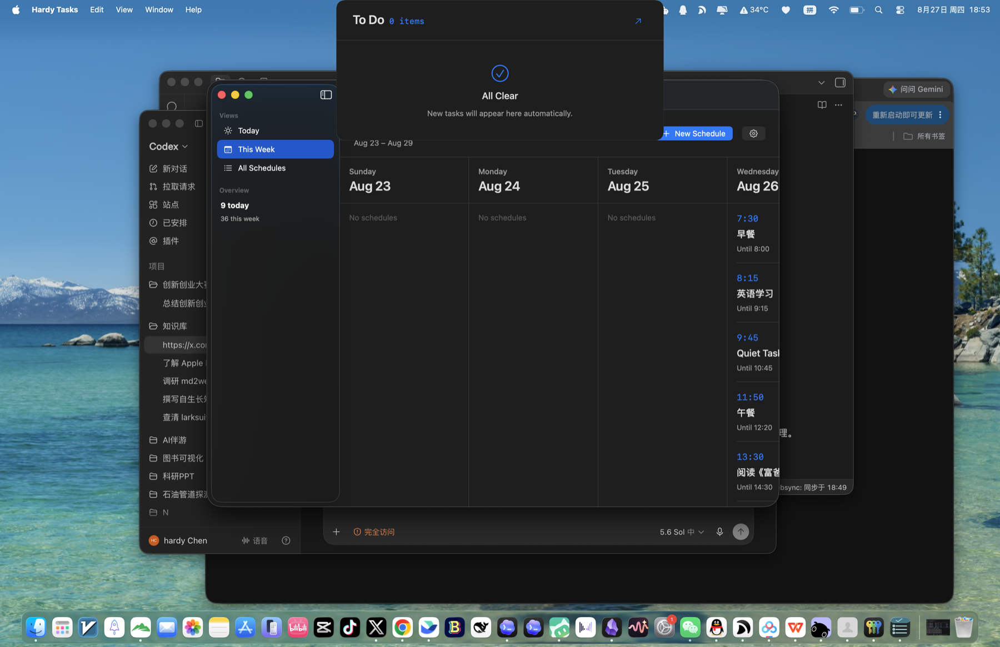

# Hardy Tasks

<p align="center">
  A calm, native macOS day compass for schedules, deadlines, and the next thing that matters.
</p>

<p align="center">
  
  
  
</p>



Hardy Tasks combines a lightweight task manager, a week schedule, a real WidgetKit desktop widget, and two edge interactions designed for notched MacBooks. It is local-first, account-optional, and intentionally quieter than a full project-management suite.

> 中文简介：一款原生、克制的 macOS 日程与待办工具。左侧边缘看今天，刘海区域勾任务，桌面小组件持续显示真正需要完成的事项。

## The two workspaces

Schedules and tasks stay separate so each surface has one job.

| Schedule | Tasks |
| --- | --- |
|  |  |
| See today, this week, or every schedule without mixing them into your task list. | Capture, prioritize, pin, repeat, complete, and restore actionable tasks. |

## Designed around the edges of your Mac

### Today at the left edge

Move the pointer into the middle section of the left screen edge to reveal today's read-only timeline. The panel avoids the menu bar and Dock, then folds away when the pointer leaves.



### Tasks around the notch

Move the pointer into the physical notch area to expand the task island. Check off tasks without opening the main window; move away and it contracts automatically.



## Deadline awareness without notification fatigue

- A rounded light field ripples inward from all four screen edges three times.
- Blue means approaching, orange means urgent, and red means overdue.
- After the wave, the task island shows the closest upcoming deadline first, then an overdue task with the remaining overdue count.
- Quiet hours run from 23:30 to 07:30.
- Full-screen work and Apple screen recording are not interrupted; one combined reminder appears afterward.
- Blue, orange, and red preview controls are available in Settings.
- A standard macOS notification fallback is optional.

The visual treatment uses Core Animation layers and stops completely when hidden. The edge overlays ignore mouse events and respect Reduce Motion.

## Task features

- Native SwiftUI app and WidgetKit desktop widget.
- Small, medium, and large widget sizes.
- Open, Today, All Tasks, and Done views.
- Deadlines with optional notification lead times.
- Low, Normal, and High priorities.
- One-level subtasks with progress tracking.
- Daily, weekly, and monthly recurrence.
- Pinned tasks that stay above the regular list.
- System, light, and dark appearance modes.
- Optional read-only Google Tasks import.
- No account or cloud service required for local use.

## Requirements

- macOS 14 or newer.
- Xcode with the macOS SDK for building from source.
- Designed and tested on an Apple Silicon MacBook Air with a notch; the main app and widget also work without one.

## Build from source

```bash
git clone https://github.com/hardychen-19/Hardy-tasks.git
cd Hardy-tasks

xcodebuild \
  -project QuietTasks.xcodeproj \
  -scheme "Quiet Tasks" \
  -configuration Release \
  -derivedDataPath XcodeDerivedData \
  -destination 'generic/platform=macOS' \
  build
```

Install the locally built app:

```bash
cp -R "XcodeDerivedData/Build/Products/Release/Quiet Tasks.app" /Applications/
open -a "/Applications/Quiet Tasks.app"
```

The bundle keeps the original internal product and data identifiers for upgrade compatibility, while Finder, the menu bar, and Widget Gallery display **Hardy Tasks**.

## Add the desktop widget

1. Open Hardy Tasks once.
2. Right-click the desktop and choose **Edit Widgets**.
3. Search for **Hardy Tasks**.
4. Drag the preferred size onto the desktop and click **Done**.

Unsigned local builds may require approval in **System Settings → Privacy & Security**.

## Local data and privacy

Hardy Tasks keeps local task and schedule data separate:

```text
/Users/Shared/QuietTasks/tasks.json
/Users/Shared/QuietTasks/schedule.json
```

The existing path is retained so current Quiet Tasks installations can upgrade without losing data. Local features do not require an account. The optional Google Tasks connection requests read-only access and never edits Google tasks.

## Optional Google Tasks import

1. Create an OAuth client for an installed/native app in Google Cloud.
2. Add `com.rakeshutekar.quiettasks:/oauth2redirect` as a redirect URI.
3. Open **Hardy Tasks → Settings → Google Tasks**.
4. Paste the client ID, connect, select a list, and sync.

Only `https://www.googleapis.com/auth/tasks.readonly` is requested. Google due dates are date-only, so imported tasks may not contain an exact time.

## Project structure

- `Sources/QuietTasksApp/QuietTasksApp.swift` — app and task workspace.
- `Sources/QuietTasksApp/DailyFlow.swift` — schedule workspace, edge panel, task island, and deadline waves.
- `Sources/QuietTasksWidget/` — WidgetKit extension.
- [`PRODUCT.md`](PRODUCT.md) — product boundaries and interaction model.
- [`DESIGN.md`](DESIGN.md) — visual and motion specification.

## Contributing

Issues and pull requests are welcome. Please preserve the core principles: native behavior, calm visuals, local-first data, and low idle resource use.

Useful areas include signed distribution, App Group migration, keyboard shortcuts, optional iCloud sync, two-way Google Tasks sync, accessibility, and localization.

## License

[MIT](LICENSE). Use it, fork it, and make it yours.
